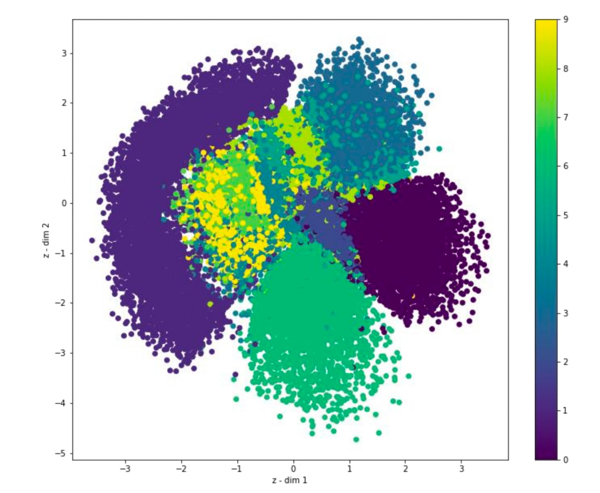
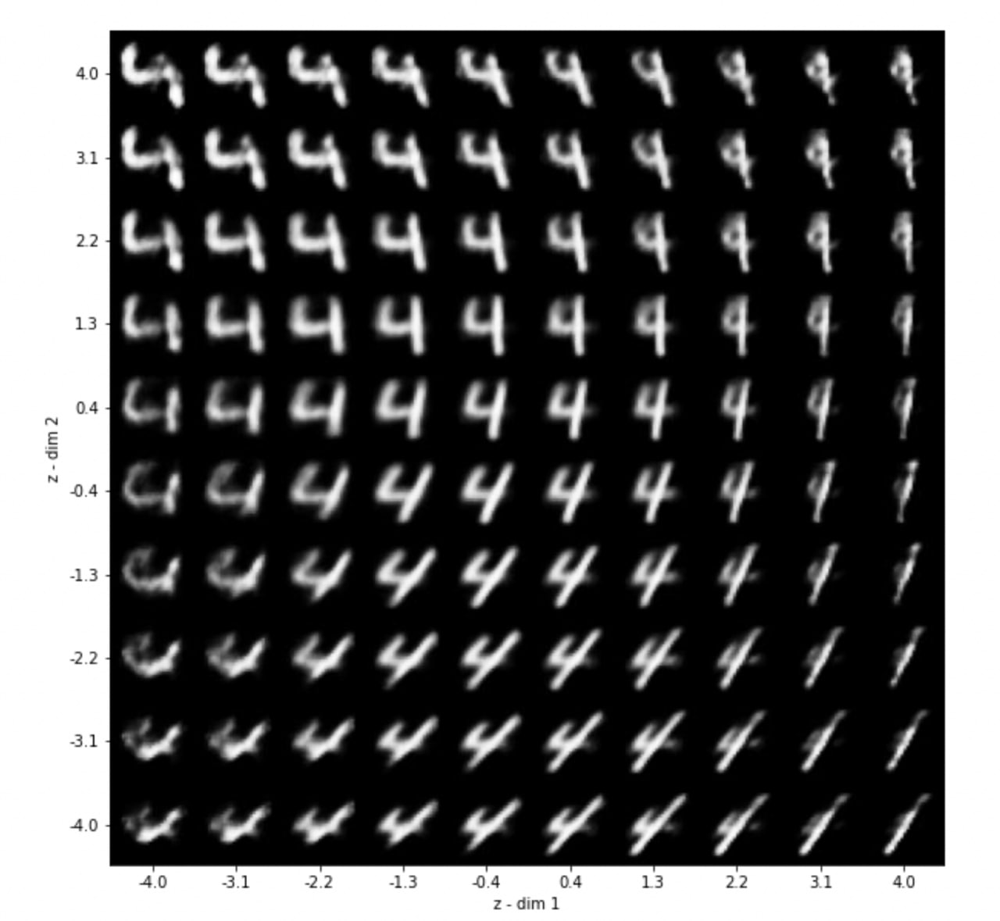

# GenerativeModels

## Variational AutoEncoder
The first part is an implementation of **VAE** models and fitting that on **MNIST** dataset. 
The plot which is added shows the scatter plot after mapping to a second environment.

Also the image below plots the instances taken from the scatter above and its encoding's result.

The change in network quality in generating images can be shown by comparison of the two furthur images which the first one is corresponding to the results at the end of second epoch, and the next to the one after 50th epoch.

## Conditional Variational AutoEncoder

There is also an implementation of a CVEA, in which the scatter plot shows the difference in disperse of samples in comparison to the previous one. 

Furturmore, if we plot the samples in the same area as the one plotted beforehand, we see that the pattern of numbers are completely different.

More details, such as considering two loss function and tuning the network are added in the attached report.

## CycleGAN

In this part, we used the **CycleGAN** architecture in order to get the painting version of the photoes provided. For Generator, we used the **U-Net** architecture and for Discriminator we used **PatchGAN**.
In two images below, you can see the original and the generated pictures. 
These images are recorded after one epoch of training and as we focus, we can see the change in the colors is started. 

More details are provided in the attached report.

